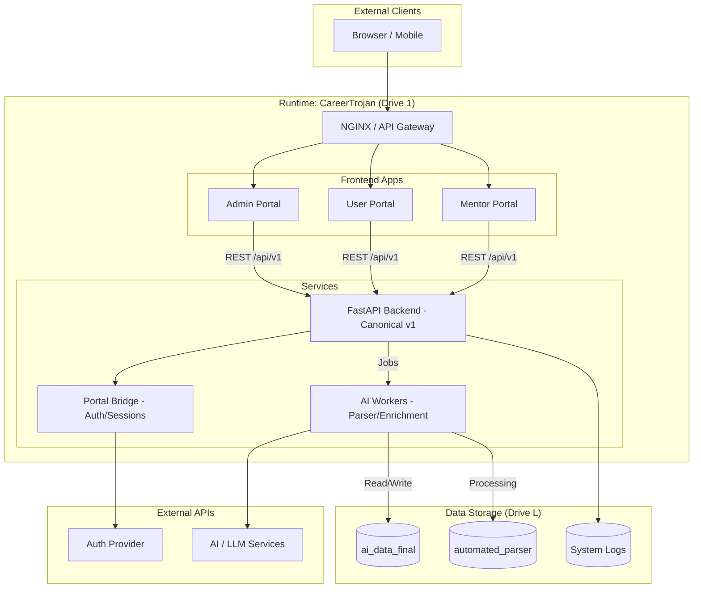

# CareerTrojan Runtime Build Plan

**Last Updated**: 2026-02-09 (Session 6 — All routers mounted, middleware stack complete, 136 tests green)

This document outlines the strategy for building the **CareerTrojan Runtime Version**, emerging from the **IntelliCV-AI** system. The goal is to create a high-performance, unified platform that links seamlessly with the `L:\VS ai_data final - version` dataset.

## User Review Required

> [!IMPORTANT]
> **Global Renaming:** Every instance of "Intellicv-AI" will be rebranded to **CareerTrojan**. This includes headers, titles, logging, and metadata across all portals.
>
> **Python 3.11 Environment:** Standardised on **Python 3.11.9** at `C:\Python\python.exe`. All ghost versions removed (2026-02-08).
>
> **Consolidation:** We are moving from a "per-page" fragmented React structure to three unified portals: **Admin**, **User**, and **Mentor**.
>
> **Data & AI Linking:** The runtime uses junction mounts at `C:\careertrojan\data-mounts\` pointing to `L:\VS ai_data final - version`. Tandem sync to `E:\CareerTrojan\USER_DATA_COPY\`.
>
> **Configuration Phase 1 (Testing):** A Premium Test User (`janj3143`) will be auto-seeded.
>
> **Asset Location:** The Official Logo located at `L:\antigravity_version_ai_data_final\FULL_REACT_PAGES\careertrojan-logo` MUST be used. No variations.
>
> **Docker Config:** Runtime will expose port **8500** (Web) and use the 8500-8600 range to avoid conflicts >8700. Container name `CaReerTroJan-Antigravity`.

## 🔒 Security & Access Protocols (Critical Review)

> [!CAUTION]
> **Admins MUST NEVER view or store user passwords.**

### 1. Admin Impersonation ("Masquerade Mode")
To allow Admins to debug user issues without compromising security:
1.  **Authentication**: Admin logs in with mandatory **2FA**.
2.  **Action**: Admin selects "Impersonate" on a user profile.
3.  **Mechanism**: The server issues a temporary, time-limited **Session Token** for that user.
4.  **Audit**: This action is logged in the immutable security log: `[ALERT] Admin X started impersonation of User Y`.

### 2. Log Immutability
- All logs in `USER DATA` are enforced as **Read-Only** immediately after writing.
- **Admin Review**: Access to these logs requires active 2FA verification.

### 3. Test Identity
- **Username**: `janj3143`
- **Role**: Premium User (Seeded on Bootstrap)

## 🪤 Data Integrity Traps (Anti-Contamination)
To ensure the system is using **Real AI Data** and not falling back to hardcoded demos:
- **The "Sales vs Python" Trap**: We will run an inference test on a "Sales Person" profile.
    - **Pass**: Result suggests "Account Executive", "Business Development".
    - **FAIL**: Result suggests "Python Developer", "Machine Learning Engineer" (Common hardcoded defaults).
- **Behavior**: If a Trap is triggered, the Runtime will **HALT** with a `DATA_CONTAMINATION_ERROR`.

## Proposed Architecture

### 1. Code Structure (in `c:\careertrojan`)

```
careertrojan/
├── apps/
│   ├── admin-portal/       # Unified React Admin app
│   ├── user-portal/        # Unified React User app
│   └── mentor-portal/      # Unified React Mentor app
├── services/
│   ├── backend-api/        # FastAPI Canonical API (v1)
│   ├── ai-workers/         # Resume parsing & enrichment workers
│   └── portal-bridge/      # Shared API client & auth logic
├── shared/
│   ├── contracts/          # OpenAPI & Data schemas
│   ├── registry/           # Dynamic capability registry (Flexibility Layer)
│   └── utils/              # Shared Python/JS utilities
├── infra/
│   ├── venv-py311/         # Python 3.11 Virtual Environment
│   ├── docker-compose.yml  # Local runtime orchestration
│   └── nginx/              # Reverse proxy & routing
└── scripts/                # Build and migration scripts
```

### 2. Implementation Phases

#### Phase 1: Foundation & Renaming ✅ COMPLETE
- [x] Initialize `c:\careertrojan` and create a **Python 3.11** virtual environment.
- [x] Install mandatory packages from requirements files.
- [x] Run a global search-and-replace to change "Intellicv-AI" to "CareerTrojan".
- [x] Set up the `portal-bridge` to handle unified authentication and API requests.

#### Phase 2: Flexible Mapping & Consolidation ✅ COMPLETE
- [x] **Capability Registry:** Dynamic registry in `shared/registry` for toggling AI models, parsers, or UI modules.
- [x] **Admin Portal:** 31 pages (00–31) + 29 tools + 10 ops pages in `apps/admin/src/pages/`.
- [x] **User Portal:** 15 pages + ConsolidationPage in `apps/user/src/pages/`.
- [x] **Mentor Portal:** 12 pages in `apps/mentor/src/pages/`.

#### Phase 3: Backend & Data Linking ✅ COMPLETE
- [x] Deploy the FastAPI `backend-api` with versioned routes (`/api/{domain}/v1/*`).
- [x] Wire the `L:\VS ai_data final - version` path via junction mounts in `data-mounts/`.
- [x] Implement the `ai-workers` to process files in the `automated_parser` directory.
- [x] **29 routers** registered — all mounted (10 via try/except for graceful degradation).
- [x] **Middleware stack**: RequestCorrelationMiddleware → InteractionLoggerMiddleware → RateLimitMiddleware.
- [x] **Braintree payment gateway** — sandbox integration complete, 27 unit + 20 e2e tests passing.
- [x] **GDPR router** — data export/deletion endpoints.

#### Phase 4: Page-by-Page Testing & Validation — IN PROGRESS
- [x] Map every route defined in `MAPPING.md` to a functioning React page.
- [x] Verify API connectivity for core interactions (Resume Upload, Enrichment, etc.).
- [x] **136 tests green** across unit/integration/e2e tiers.
- [ ] **Run endpoint introspection pipeline** to verify full endpoint count (~160-300 estimated).
- [ ] **Update ~25 React API callsites** still referencing old prefixes to new `/api/.../v1` paths.
- [ ] **Full validation deep-dive** — contamination traps, live data checks, sync verification.

## Visual Diagram (Runtime Architecture)



## Phase 5: React Page Reconciliation ✅ COMPLETE (Feb 2026)
> Canonical source: `E:\Archive Scripts\pages order\`

### Admin Portal — 31 Pages + Tools + Ops
All 31 pages (00–31) from the archive are **enacted** in `apps/admin/src/pages/`.
- [x] Pages 00–30 verified present in React routes
- [x] **Page 31: Admin Portal Entry Point** — `AdminPortalEntry.tsx`, route `/admin/portal-entry`
- [x] Tools pages (29 tools) wired under `/admin/tools/*`
- [x] Operations pages (10 ops) wired under `/admin/ops/*`

### User Portal — 15 Pages + Consolidation
Pages 01–15 (skipping 06) from the archive are enacted in `apps/user/src/pages/`.
- [x] Pages 01–15 verified present in React routes
- [x] Visualisations Hub added (beyond archive scope)
- [x] **Consolidation Page** — `ConsolidationPage.tsx`, route `/consolidation`

### Mentor Portal — 12 Pages
All 12 pages from the archive are enacted in `apps/mentor/src/pages/` with React routes.
- [x] Pages 01–12 verified present and routed

## Phase 6: Data Architecture & Duplication Strategy ✅ COMPLETE (Feb 2026)

### Source of Truth
- **Primary Data Store**: `L:\VS ai_data final - version\`
  - `ai_data_final/` — AI knowledge base (JSON, parsed CVs, job data)
  - `automated_parser/` — Raw document ingestion pipeline
  - `USER DATA/` — User sessions, audit logs, profiles, trap data
- **Runtime Data Mounts**: `C:\careertrojan\data-mounts\`
  - `ai-data` → junction to `L:\VS ai_data final - version`
  - `parser` → junction to `L:\VS ai_data final - version\automated_parser`

### Tandem Duplication (L: ↔ E:)
- **Mirror Location**: `E:\CareerTrojan\USER_DATA_COPY\`
- **Sync Traps**: Every write to `L:\...\USER DATA\` must be automatically mirrored to `E:\CareerTrojan\USER_DATA_COPY\`
- **Structure**: Both locations maintain identical subdirectories:
  ```
  USER DATA/
  ├── sessions/          # Login history, active sessions
  ├── profiles/          # User profiles, digital twins
  ├── interactions/      # Every user action (enrichment, search, upload)
  ├── cv_uploads/        # User resume files
  ├── ai_matches/        # AI-generated match results
  ├── session_logs/      # Full session replay data
  ├── admin_2fa/         # Admin security
  ├── test_accounts/     # Seed/test data
  ├── trap_profiles/     # Anti-contamination traps
  ├── user_registry/     # Master user index
  └── _sync_metadata.json
  ```
- **Rationale**: Protects against single-drive failure; both datasets are always current.

### AI Orchestrator Feedback Loop
```
User Login/Action → USER DATA (L:)
       ↓                    ↓ (sync trap)
  AI Orchestrator      USER_DATA_COPY (E:)
       ↓
  ai_data_final enrichment
       ↓
  Knowledge base update
```
- User resume uploads, match results, coaching interactions, and enrichment outputs feed back into `ai_data_final` via the AI orchestrator.
- The orchestrator reads from `USER DATA/interactions/` and writes enriched entries to `ai_data_final/`.

## Phase 7: Endpoint & API Reconciliation ✅ COMPLETE (Feb 2026)
- **29 routers** registered in FastAPI backend — ALL mounted
  - 19 core routers mounted directly
  - 10 supplementary routers mounted via try/except (graceful degradation)
- `shared.router` — ✅ Fixed and mounted (2026-02-08)
- `rewards.router` — ✅ Collision fixed, moved to `/api/rewards/v1`
- All prefixes standardised to `/api/{domain}/v1`
- **Braintree payment** integrated (7 new endpoints, sandbox tested)
- **GDPR router** added (data export/deletion)
- **Middleware stack** complete: correlation IDs → interaction logging → rate limiting
- Endpoint mapping pipeline tools exist: `fastapi_introspect_routes.py` → `react_api_scan.py` → `join_endpoint_graph.py`
- **Portal Bridge** (`config/nginx/portal-bridge.conf`): Routes `/` → user, `/admin` → admin, `/mentor` → mentor, `/api` → backend
- **Known remaining work**:
  - Run endpoint introspection pipeline to generate visual map
  - Update ~25 React frontend API callsites to new `/api/.../v1` prefixes

## Phase 8: Cleanup & Script Hygiene (Feb 2026)
Remove from `C:\careertrojan\`:
- Legacy migration scripts (e.g., `recut_migration.ps1`)
- One-off visual pack generators
- `.backup.*` files in portal directories
- Duplicate/orphaned docker-compose files in app subdirectories
- Utility scripts that have been superseded by the runtime

## Verification Plan

### Automated Tests — 136 Passing ✅
- **Unit** (`tests/unit/`): 7 test files — bootstrap, braintree, endpoints, GDPR, models, observability, security
- **Integration** (`tests/integration/`): 4 test files — contamination trap, GDPR endpoints, HTTP endpoints, observability
- **E2E** (`tests/e2e/`): 1 test file — Braintree sandbox (20 tests against real API)
- **Root conftest.py**: Auto-loads .env, session-scoped app/client/db fixtures, auto-resets rate limiter
- **Contract Validation:** Use `schemathesis` to verify FastAPI matches the OpenAPI spec.
- **Renaming Integrity:** Scripted grep to ensure zero instances of "Intellicv-AI" remain.
- **Sync Trap Validation:** Write a test file to `L:\...\USER DATA\test\` and verify it appears in `E:\CareerTrojan\USER_DATA_COPY\test\` within 5 seconds.
- **Endpoint Coverage:** Run endpoint introspection pipeline and verify count matches 29 registered routers.

### Manual Verification
1. **Login Flow:** Verify "CareerTrojan" branding on the login page and successful JWT acquisition.
2. **Resume Upload:** Upload a test resume to the User Portal and verify it appears in `L:\VS ai_data final - version\automated_parser`.
3. **Admin Monitor:** Check the Admin Status Monitor to see live health checks of all services.
4. **Data Mapping:** Pick three random pages from `MAPPING.md` and verify they render correctly with live data.
5. **Page 31:** Verify Admin Portal entry point page loads and authenticates.
6. **Consolidation Page:** Verify User Consolidation page renders with combined user data.
7. **AI Feedback:** Verify a user interaction writes to both L: and E: user data, and triggers orchestrator enrichment.
