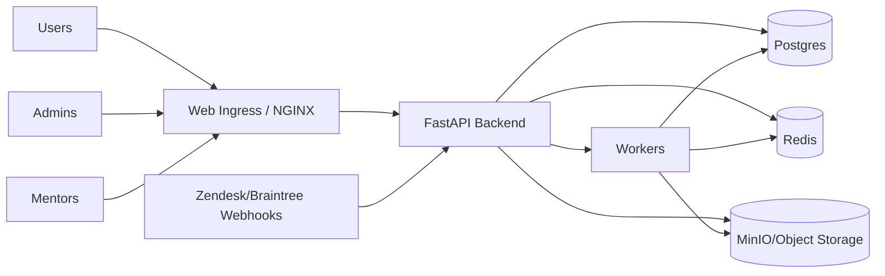

```mermaid
flowchart LR
    U[Users] --> W[Web Ingress / NGINX]
    A[Admins] --> W
    M[Mentors] --> W
    W --> API[FastAPI Backend]
    Z[Zendesk/Braintree Webhooks] --> API
    API --> P[(Postgres)]
    API --> R[(Redis)]
    API --> O[(MinIO/Object Storage)]
    API --> WK[Workers]
    WK --> P
    WK --> R
    WK --> O
```
